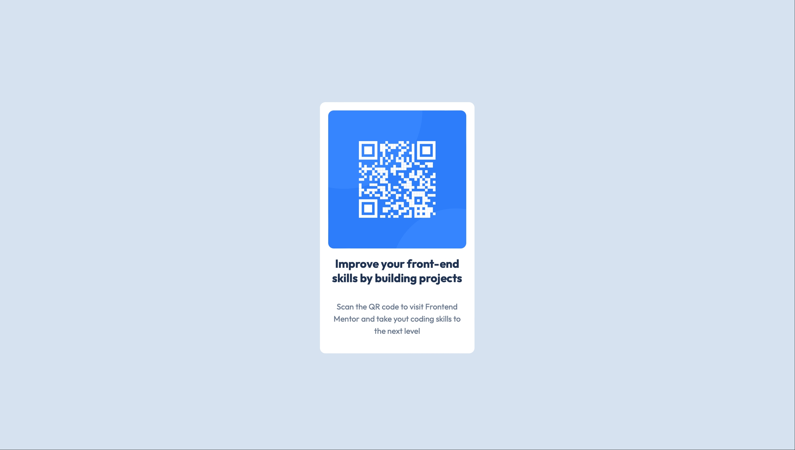

# QR Code Component

## Обзор проекта

Проект представляет собой QR-код и описание, куда он ведёт. Создан для прочтения QR-кода на странице.

## Скриншот

Находится в корневой папке под названием `preview.jpeg`.

## Ссылки

- 🔗 [Живой сайт](https://suna-hab.github.io/tren-site/)
- 📁 [Код на GitHub](https://github.com/Suna-hab/tren-site)

## Мой прогресс

Начал разработку с HTML. Подключил шрифт, расписал теги, дал названия классам. Далее написал SCSS и создал переменные в файле `_variables`, скомпилировал в CSS.

## Создано с помощью

- HTML5
- SCSS
- БЭМ
- Flexbox
- Google Fonts (Outfit)

## Что узнал

Сам по себе проект был лёгкий, но узнал о новых инструментах и препроцессорах: Git, GitHub, SCSS.

## Продолжение разработки

- Всё сделано в соответствии с макетом.
- Будут добавляться новые QR-коды.

## Автор

- GitHub: [@Suna-hab](https://github.com/Suna-hab)
- Frontend Mentor: [@Suna-hab](https://www.frontendmentor.io/profile/Suna-hab)

## Благодарности

Спасибо Frontend Mentor за челлендж.